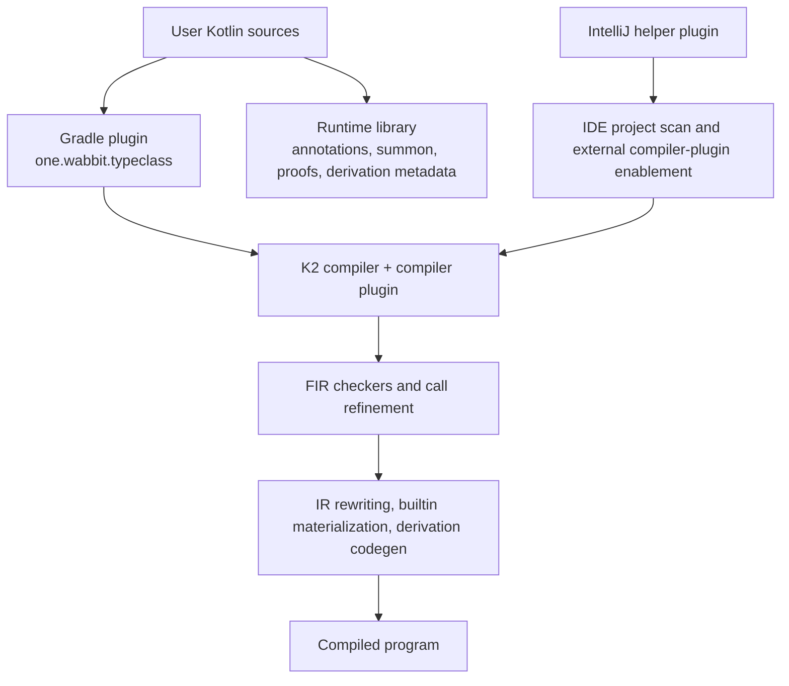

# Architecture

This document describes how the repository is structured and where the important behavior lives.

## High-Level View

The runtime library is intentionally small. Most behavior lives in the compiler plugin, which is easiest to think about as three layers:

- discovery and indexing
- FIR validation and call refinement
- IR rewriting and code generation

## Repository Topology

The repository is split into four main modules:

| Module | Purpose |
| --- | --- |
| `library` | public runtime API used from Kotlin code |
| `gradle-plugin` | typed Gradle integration that wires the compiler plugin into Kotlin compilations |
| `compiler-plugin` | K2 implementation that performs discovery, validation, planning, rewriting, and code generation |
| `ij-plugin` | IntelliJ helper plugin that enables external K2 compiler-plugin loading for trusted projects |

In normal consumer builds:

1. application code depends on `one.wabbit:kotlin-typeclasses`
2. the build applies `one.wabbit.typeclass`
3. the Gradle plugin resolves the Kotlin-matched compiler-plugin artifact
4. the compiler plugin performs typeclass resolution during Kotlin compilation

## Module Boundaries

### Runtime library

Location: [`library/`](../library/)

Important files:

- [`Typeclass.kt`](../library/src/commonMain/kotlin/one/wabbit/typeclass/Typeclass.kt)
- [`Instance.kt`](../library/src/commonMain/kotlin/one/wabbit/typeclass/Instance.kt)
- [`Summon.kt`](../library/src/commonMain/kotlin/one/wabbit/typeclass/Summon.kt)
- [`Derivation.kt`](../library/src/commonMain/kotlin/one/wabbit/typeclass/Derivation.kt)
- [`Proofs.kt`](../library/src/commonMain/kotlin/one/wabbit/typeclass/Proofs.kt)

Responsibilities:

- declare the public annotations and helper APIs
- define derivation metadata containers such as `ProductTypeclassMetadata` and `SumTypeclassMetadata`
- expose builtin proof interfaces like `Same`, `Subtype`, `KnownType`, and `TypeId`
- stay small enough that most semantics remain compiler-owned rather than runtime-reflection-driven

### Compiler plugin

Location: [`compiler-plugin/`](../compiler-plugin/)

Entry point:

- [`TypeclassCompilerPluginRegistrar.kt`](../compiler-plugin/src/main/kotlin/one/wabbit/typeclass/plugin/TypeclassCompilerPluginRegistrar.kt)

The three layers described above are implemented here:

1. discovery and indexing:
   [`TypeclassPluginSharedState.kt`](../compiler-plugin/src/main/kotlin/one/wabbit/typeclass/plugin/TypeclassPluginSharedState.kt),
   [`TypeModel.kt`](../compiler-plugin/src/main/kotlin/one/wabbit/typeclass/plugin/model/TypeModel.kt),
   [`WrapperPlanner.kt`](../compiler-plugin/src/main/kotlin/one/wabbit/typeclass/plugin/model/WrapperPlanner.kt)
2. FIR validation and call refinement:
   [`TypeclassFirCheckersExtension.kt`](../compiler-plugin/src/main/kotlin/one/wabbit/typeclass/plugin/TypeclassFirCheckersExtension.kt),
   [`TypeclassFirFunctionCallRefinementExtension.kt`](../compiler-plugin/src/main/kotlin/one/wabbit/typeclass/plugin/TypeclassFirFunctionCallRefinementExtension.kt),
   [`TypeclassFirExpressionResolutionExtension.kt`](../compiler-plugin/src/main/kotlin/one/wabbit/typeclass/plugin/TypeclassFirExpressionResolutionExtension.kt)
3. IR rewriting and code generation:
   [`TypeclassIrGenerationExtension.kt`](../compiler-plugin/src/main/kotlin/one/wabbit/typeclass/plugin/TypeclassIrGenerationExtension.kt),
   [`DeriveSupport.kt`](../compiler-plugin/src/main/kotlin/one/wabbit/typeclass/plugin/DeriveSupport.kt)

### Gradle plugin

Location: [`gradle-plugin/`](../gradle-plugin/)

Entry point:

- [`TypeclassGradlePlugin.kt`](../gradle-plugin/src/main/kotlin/one/wabbit/typeclass/gradle/TypeclassGradlePlugin.kt)

Responsibilities:

- register compiler-plugin support with Kotlin Gradle plugin
- resolve the compiler plugin artifact version that matches the applied Kotlin version
- add `-Xcontext-parameters`

### IntelliJ plugin

Location: [`ij-plugin/`](../ij-plugin/)

Entry point:

- [`TypeclassIdeSupportActivity.kt`](../ij-plugin/src/main/kotlin/one/wabbit/typeclass/idea/TypeclassIdeSupportActivity.kt)

Responsibilities:

- detect compiler-plugin usage in imported compiler classpaths and Gradle files
- enable IntelliJ's external K2 compiler-plugin path for the current trusted project
- request Gradle reimport when only the Gradle plugin declaration is visible

It does not implement a separate typechecker; instead, it enables the IDE to load the real compiler plugin.

## Configuration Flow

The effective behavior comes from three layers:

1. build wiring through the Gradle plugin or direct CLI options
2. source-level annotations in the runtime library
3. compiler-plugin planning and rewriting based on the current goal and visible context

Examples:

- applying `one.wabbit.typeclass` controls whether the compiler plugin is present at all
- CLI options control optional builtins and tracing
- source annotations such as `@Typeclass`, `@Instance`, `@Derive`, and `@DebugTypeclassResolution` shape what the plugin will do inside the compilation

## Discovery And Resolution Planning

The plugin keeps a session-scoped index of relevant declarations.

In this document, "typeclass scope" means the current goal's search space: direct local context plus eligible indexed rules, derived rules, and builtins.

Important files:

- [`TypeclassPluginSharedState.kt`](../compiler-plugin/src/main/kotlin/one/wabbit/typeclass/plugin/TypeclassPluginSharedState.kt)
- [`TypeModel.kt`](../compiler-plugin/src/main/kotlin/one/wabbit/typeclass/plugin/model/TypeModel.kt)
- [`WrapperPlanner.kt`](../compiler-plugin/src/main/kotlin/one/wabbit/typeclass/plugin/model/WrapperPlanner.kt)

Core ideas:

- source declarations are scanned into resolution indexes
- goals and rules are normalized into a lightweight internal model (`TcType`, `InstanceRule`)
- `TypeclassResolutionPlanner` resolves a desired goal against local context and available rules
- ambiguity, missing evidence, and recursive resolution are modeled explicitly

The planner is the shared "brain" used by both the FIR and IR sides, which keeps frontend masking and backend rewriting aligned.

## FIR Responsibilities

Important files:

- [`TypeclassFirCheckersExtension.kt`](../compiler-plugin/src/main/kotlin/one/wabbit/typeclass/plugin/TypeclassFirCheckersExtension.kt)
- [`TypeclassFirFunctionCallRefinementExtension.kt`](../compiler-plugin/src/main/kotlin/one/wabbit/typeclass/plugin/TypeclassFirFunctionCallRefinementExtension.kt)
- [`TypeclassFirExpressionResolutionExtension.kt`](../compiler-plugin/src/main/kotlin/one/wabbit/typeclass/plugin/TypeclassFirExpressionResolutionExtension.kt)

What FIR does:

- validates declarations such as `@Instance`, `@Derive`, `@DeriveVia`, and `@DeriveEquiv`
- computes whether typeclass context parameters can be satisfied
- refines function-call signatures so resolvable typeclass context parameters disappear from the user-facing call shape
- injects limited implicit receivers derived from the containing function's extension receiver when that receiver expands to local typeclass evidence
- emits user-facing diagnostics early, before IR

What FIR does not do:

- it does not fully lower contextual calls
- it does not own the final synthesized evidence values

[`TypeclassFirExpressionResolutionExtension`](../compiler-plugin/src/main/kotlin/one/wabbit/typeclass/plugin/TypeclassFirExpressionResolutionExtension.kt) is not a placeholder. Its scope is just narrower than the call-refinement layer: it adds implicit receivers for typeclass-compatible expansions of the containing function's extension receiver, so receiver-style typeclass member access can resolve inside that body. It does not replace the main call-refinement path, and it does not perform backend rewriting.

## IR Responsibilities

Important file:

- [`TypeclassIrGenerationExtension.kt`](../compiler-plugin/src/main/kotlin/one/wabbit/typeclass/plugin/TypeclassIrGenerationExtension.kt)

This is where the final semantics are enforced, so it is usually the first place to look when generated behavior is wrong.

IR responsibilities include:

- rewriting wrapper-like calls back to the original declarations with synthesized evidence
- materializing builtin proofs and optional builtins
- generating derived instances for the current compilation and recording successful derived-instance metadata for downstream recompilation
- handling recursive derivation cells safely
- emitting final diagnostics when a planner-success approximation still needs a backend validity check

## Derivation Pipeline

Derivation spans both runtime and compiler-plugin code.

Runtime pieces:

- `ProductTypeclassDeriver`
- `TypeclassDeriver`
- metadata types in [`Derivation.kt`](../library/src/commonMain/kotlin/one/wabbit/typeclass/Derivation.kt)

Compiler-plugin pieces:

- [`DeriveSupport.kt`](../compiler-plugin/src/main/kotlin/one/wabbit/typeclass/plugin/DeriveSupport.kt)
- [`DeriveViaModel.kt`](../compiler-plugin/src/main/kotlin/one/wabbit/typeclass/plugin/DeriveViaModel.kt)
- [`TypeclassIrGenerationExtension.kt`](../compiler-plugin/src/main/kotlin/one/wabbit/typeclass/plugin/TypeclassIrGenerationExtension.kt)

The compiler plugin:

- discovers `@Derive`, `@DeriveVia`, and `@DeriveEquiv`
- validates that the target typeclass companion satisfies the required derivation contract
- synthesizes metadata for products, sums, and enums
- builds the generated instances and integrates them into normal rule search for the current compilation
- publishes successful cross-module derivations by emitting metadata annotations that downstream compiler runs reconstruct back into rules

## Current Semantic Boundaries

These are intentional boundaries, not silent accidents:

- resolution is annotation-driven; interfaces without `@Typeclass` do not participate
- ambiguity is reported rather than broken by a hidden coherence policy
- the FIR side refines function calls, but plain property reads are currently limited by missing property-read refinement hooks in the public FIR plugin API
- builtin proof materialization is filtered by goal shape and, for some builtins, by whether the requested type is runtime-materializable

## Diagnostics And Tracing

Important files:

- [`TypeclassDiagnosticIds.kt`](../compiler-plugin/src/main/kotlin/one/wabbit/typeclass/plugin/TypeclassDiagnosticIds.kt)
- [`TypeclassDiagnostics.kt`](../compiler-plugin/src/main/kotlin/one/wabbit/typeclass/plugin/TypeclassDiagnostics.kt)
- [`TypeclassDiagnosticNarratives.kt`](../compiler-plugin/src/main/kotlin/one/wabbit/typeclass/plugin/TypeclassDiagnosticNarratives.kt)
- [`TypeclassTracing.kt`](../compiler-plugin/src/main/kotlin/one/wabbit/typeclass/plugin/TypeclassTracing.kt)

The plugin takes diagnostics seriously:

- declaration errors are checked in FIR
- planner results distinguish missing, ambiguous, and recursive outcomes
- trace mode can explain alternatives, not just final failure
- narrative helpers exist so emitted errors describe what actually happened during resolution

## Testing Strategy

The repository has different test layers for different failure modes.

### Runtime library tests

- [`ProofsTest.kt`](../library/src/commonTest/kotlin/one/wabbit/typeclass/ProofsTest.kt)

These validate pure runtime API behavior.

### Compiler-plugin unit and integration tests

- model and helper tests under [`compiler-plugin/src/test/kotlin/one/wabbit/typeclass/plugin/`](../compiler-plugin/src/test/kotlin/one/wabbit/typeclass/plugin/)
- integration suites under [`compiler-plugin/src/test/kotlin/one/wabbit/typeclass/plugin/integration/`](../compiler-plugin/src/test/kotlin/one/wabbit/typeclass/plugin/integration/)

The integration harness lives in:

- [`IntegrationTestSupport.kt`](../compiler-plugin/src/test/kotlin/one/wabbit/typeclass/plugin/integration/IntegrationTestSupport.kt)

It compiles source strings with the real K2 JVM compiler, feeds in plugin jars and options, and asserts on both runtime output and structured diagnostics.

### Gradle plugin tests

- [`TypeclassGradlePluginFunctionalTest.kt`](../gradle-plugin/src/test/kotlin/one/wabbit/typeclass/gradle/TypeclassGradlePluginFunctionalTest.kt)

This is the best reference for the intended consumer Gradle setup.

### IntelliJ plugin tests

The IntelliJ module tests cover:

- plugin.xml shape
- detection of compiler-plugin usage
- decision-making for enabling IDE support

## Publishing Model

The repository publishes:

- a plain-version runtime library
- a plain-version Gradle plugin
- a Kotlin-line-specific compiler plugin
- an IntelliJ helper plugin artifact

Compiler-plugin coordinates use the form:

- `one.wabbit:kotlin-typeclasses-plugin:<baseVersion>-kotlin-<kotlinVersion>`

That version split exists because compiler-plugin binaries are tied to the Kotlin compiler APIs they were built against.

## Design Notes And Backlog

Two docs are especially useful when you need the current design state rather than only the code:

- [`compiler-plugin/PLAN.md`](../compiler-plugin/PLAN.md) tracks active review remediation, open policy decisions, and correctness backlog.
- [`compiler-plugin/LEARNINGS.md`](../compiler-plugin/LEARNINGS.md) captures edge cases and implementation lessons discovered while building the plugin.

## Suggested Reading Order

If you are reviewing or extending the repository, this order works well:

1. [README.md](../README.md)
2. [docs/user-guide.md](./user-guide.md)
3. [library/README.md](../library/README.md)
4. [compiler-plugin/README.md](../compiler-plugin/README.md)
5. [compiler-plugin/PLAN.md](../compiler-plugin/PLAN.md)
6. [compiler-plugin/LEARNINGS.md](../compiler-plugin/LEARNINGS.md)
