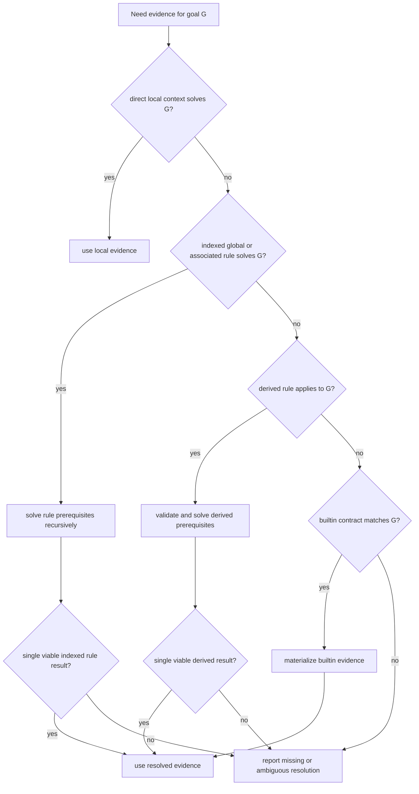

# Typeclass Model

This guide describes the core programming model of `kotlin-typeclasses`: what counts as a typeclass, where evidence comes from, what "typeclass scope" means, and how resolution proceeds.

## Typeclass Scope

In this repository, "typeclass scope" means the search space for one requested goal.

That search space is made from:

- direct local context already available at the use site
- eligible indexed `@Instance` declarations from associated companions and legal top-level owner files
- derived rules and builtins when they apply to the requested goal

Later sections unpack those pieces in more detail, but this is the core definition.

## What Counts As A Typeclass

For normal user code, a type participates in typeclass search when its interface is annotated with `@Typeclass`.

```kotlin
@Typeclass
interface Show<A> {
    fun show(value: A): String
}
```

Important implication:

- plain context parameters are not automatically treated as typeclass lookups
- interfaces or classes that merely "look like" typeclasses by shape do not participate
- the model is annotation-driven, not structural

Advanced boundary:

- ordinary application and library typeclasses should be interfaces
- subclassable abstract/open class heads are supported only in narrow cases where generated code can subclass the head through an accessible zero-argument constructor
- compiler-owned surfaces such as `Equiv` use this advanced class-head path

## Evidence Sources

The compiler plugin can satisfy a typeclass goal from several sources.

### 1. Direct local context

If the needed evidence is already present as a context parameter in the current scope, that wins first.

```kotlin
context(show: Show<A>)
fun <A> render(value: A): String = show.show(value)
```

This is the most local and explicit source of evidence, and the resolver prefers it before global search.

### 2. Global `@Instance` declarations

Supported global instance shapes are:

- top-level `@Instance` objects
- top-level `@Instance` parameterless functions whose context parameters describe prerequisites
- top-level immutable `@Instance` properties

Example:

```kotlin
@Instance
object IntShow : Show<Int> {
    override fun show(value: Int): String = value.toString()
}

@Instance
context(left: Show<A>, right: Show<B>)
fun <A, B> pairShow(): Show<Pair<A, B>> =
    object : Show<Pair<A, B>> {
        override fun show(value: Pair<A, B>): String =
            "(" + left.show(value.first) + ", " + right.show(value.second) + ")"
    }
```

`@Instance` functions use one rule-shaped form:

- no ordinary value parameters
- context parameters are prerequisites that must be solved first
- the result is one provided typeclass value

Top-level instances are not unconstrained orphans. They must live in a legal owner file: the file that declares the typeclass head or one of the concrete provided classifiers in the target. The placement rules and examples live in [Instance Authoring](./instance-authoring.md).

### 3. Associated companion scope

Global search is not package-wide magic. It is constrained by associated lookup.

For a goal like `Show<Box<Int>>`, the plugin may search:

- `Show`'s companion
- `Box`'s companion
- companions of sealed supertypes of `Show`
- companions of sealed supertypes of `Box`
- `Int`'s companion
- companions of sealed supertypes of `Int`, where relevant

Associated companions are one part of typeclass scope. They do not replace local context, derived rules, or builtins; they are one of the eligible non-local places the resolver can search.

### 4. Derived evidence

Generated evidence from `@Derive`, `@DeriveVia`, and `@DeriveEquiv` enters the same search space as manual `@Instance` declarations.

That means derivation can satisfy ordinary lookups, but it can also conflict with manual rules and participate in the same ambiguity checks. For placement and conflict guidance, see [Coordinate Manual And Derived Evidence](./instance-authoring.md#coordinate-manual-and-derived-evidence).

### 5. Builtin evidence

The compiler can also synthesize certain forms of evidence directly:

- builtin proof typeclasses such as `Same`, `Subtype`, `KnownType`, and `TypeId`
- optional `KClass<T>` evidence when `builtinKClassTypeclass=enabled`
- optional `KSerializer<T>` evidence when `builtinKSerializerTypeclass=enabled`

Those builtins are covered in detail in [Proofs And Builtins](./proofs-and-builtins.md).

## Resolution Precedence

The practical resolution order is:

1. directly available contextual evidence
2. indexed global and associated `@Instance` rules
3. derived rules where the target shape is derivable
4. builtin evidence where the goal matches a builtin contract

Visual mental model:



Two important constraints shape that order:

- there is no hidden global coherence policy
- ambiguity is a hard error when multiple candidates remain viable

In other words, the plugin does not try to invent a "best" candidate among overlapping global rules.

## Resolution Walkthrough

Consider this standard rule setup:

```kotlin
@Instance
object IntShow : Show<Int> {
    override fun show(value: Int): String = value.toString()
}

@Instance
context(left: Show<A>, right: Show<B>)
fun <A, B> pairShow(): Show<Pair<A, B>> =
    object : Show<Pair<A, B>> {
        override fun show(value: Pair<A, B>): String =
            "(" + left.show(value.first) + ", " + right.show(value.second) + ")"
    }

context(_: Show<A>)
fun <A> render(value: A): String = summon<Show<A>>().show(value)
```

When source code asks for `render(1 to 2)`, resolution proceeds conceptually like this:

1. the call needs `Show<Pair<Int, Int>>`
2. no direct local `Show<Pair<Int, Int>>` is available
3. indexed rule search finds `pairShow()`
4. applying `pairShow()` creates two prerequisite goals: `Show<Int>` and `Show<Int>`
5. those prerequisite goals resolve to `IntShow`
6. the compiler rewrites the call with the synthesized evidence chain

That recursive prerequisite solving is the normal rule model for `@Instance` functions.

Two important consequences follow:

- if a direct local `Show<Pair<Int, Int>>` were already in scope, resolution would stop there and would not need `pairShow()`
- if two different non-local rules both remained viable for `Show<Pair<Int, Int>>`, the call would fail as ambiguous instead of picking one heuristically

## `summon()` And Ordinary Context

`summon()` is:

```kotlin
context(value: T)
fun <T> summon(): T = value
```

On its own, that is just a context helper. Under the compiler plugin, `summon<Show<A>>()` becomes the user-facing way to request typeclass evidence.

That gives you two equivalent styles:

```kotlin
context(show: Show<A>)
fun <A> render1(value: A): String = show.show(value)

context(_: Show<A>)
fun <A> render2(value: A): String = summon<Show<A>>().show(value)
```

## Typeclass Scope In Practice

The easiest way to think about scope is:

- lexical scope contributes direct contextual evidence
- associated lookup contributes eligible global rules for the current goal
- derivation and builtins extend that same search space when enabled and applicable

Example:

```kotlin
data class Box<A>(val value: A) {
    companion object {
        @Instance
        context(show: Show<A>)
        fun <A> boxShow(): Show<Box<A>> =
            object : Show<Box<A>> {
                override fun show(value: Box<A>): String =
                    "Box(" + show.show(value.value) + ")"
            }
    }
}
```

`Show<Box<Int>>` can resolve here because:

- `Show<Int>` can come from local or global scope
- `Box`'s companion is in associated scope for `Box<Int>`
- the resulting `boxShow()` rule can be applied once `Show<Int>` is available

What does not happen:

- the plugin does not scan arbitrary instance-shaped member functions elsewhere on `Box`
- unrelated helper declarations in the same package do not become part of associated scope automatically
- an import does not itself make a declaration "associated"; associated scope is determined from the goal's type constructors

## What Is Not In Scope

The typeclass model is narrower than "search anywhere":

- arbitrary member declarations are not part of global typeclass search
- unannotated interfaces and classes are ignored by the resolver
- local helper functions are not automatically published as global rules
- the plugin does not infer a package-wide orphan-instance scope beyond the allowed associated owners

## Ambiguity And Failure

The plugin reports failure when:

- no candidate can satisfy the goal
- multiple candidates satisfy the goal
- a candidate's prerequisites are themselves missing or ambiguous
- the goal falls outside a builtin or derivation contract

Typical consequences:

- overlapping generic rules are allowed to exist, but ambiguous use sites fail
- direct local context can shadow synthetic builtins
- derivation does not bypass the normal ambiguity rules

## Worked Example

```kotlin
@Typeclass
interface Monoid<A> {
    fun empty(): A
    fun combine(left: A, right: A): A
}

@Instance
object IntMonoid : Monoid<Int> {
    override fun empty(): Int = 0
    override fun combine(left: Int, right: Int): Int = left + right
}

data class Box<A>(val value: A) {
    companion object {
        @Instance
        context(monoid: Monoid<A>)
        fun <A> boxMonoid(): Monoid<Box<A>> =
            object : Monoid<Box<A>> {
                override fun empty(): Box<A> = Box(monoid.empty())
                override fun combine(left: Box<A>, right: Box<A>): Box<A> =
                    Box(monoid.combine(left.value, right.value))
            }
    }
}

context(monoid: Monoid<A>)
operator fun <A> A.plus(other: A): A = monoid.combine(this, other)
```

`Box(1) + Box(2)` works because:

1. the contextual `+` wants `Monoid<Box<Int>>`
2. global search finds `Box.boxMonoid()`
3. that rule requires `Monoid<Int>`
4. `IntMonoid` satisfies that prerequisite
